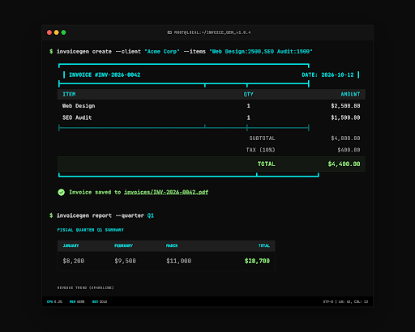

# InvoiceGen

**Professional CLI invoice generator** -- create clients, generate invoices, export to PDF, track payments, and run revenue reports. Built with Python, Typer, Rich, and SQLite.


```
$ invoicegen invoice list
                           Invoices
 ID  Invoice #        Client       Total      Status   Created     Due Date
  3  INV-2026-0003   Acme Corp   $4,300.00    Paid    2026-03-01  2026-03-31
  2  INV-2026-0002   Globex Inc  $7,850.00    Sent    2026-03-15  2026-04-14
  1  INV-2026-0001   Initech     $2,100.00   Overdue  2026-02-01  2026-03-03
```

## Screenshot



---

## Features

- **Client Management** -- Add, list, and remove clients with contact details
- **Invoice Creation** -- Generate invoices with multiple line items in one command
- **Auto-Numbering** -- Sequential invoice numbers (`INV-2026-0001`, `INV-2026-0002`, ...)
- **Status Tracking** -- Draft, Sent, Paid, Overdue with automatic overdue detection
- **PDF Export** -- Professional invoices with Brutalist-themed dark header, color-coded status badges, itemized table, and totals
- **Tax Calculation** -- Configurable tax rate applied automatically with proper rounding
- **Due Date Tracking** -- Net 30 default with configurable payment terms
- **Revenue Reports** -- Monthly and quarterly summaries with Unicode gradient bar charts
- **Rich Terminal UI** -- Brutalist Command theme with cyan headers, green accents, ghost borders
- **SQLite Persistence** -- All data stored locally at `~/.invoicegen/invoicegen.db`
- **Full Test Suite** -- 52 tests covering business logic, CRUD, PDF generation, and CLI commands

## Tech Stack

| Component | Technology |
|-----------|-----------|
| CLI Framework | [Typer](https://typer.tiangolo.com/) |
| Terminal UI | [Rich](https://rich.readthedocs.io/) with custom Brutalist theme |
| Database | SQLite3 (standard library) |
| PDF Generation | [fpdf2](https://py-pdf.github.io/fpdf2/) |
| Testing | pytest |
| Language | Python 3.10+ |

## Installation

```bash
# Clone the repository
git clone https://github.com/yourusername/invoicegen.git
cd invoicegen

# Install in development mode
pip install -e ".[dev]"

# Verify installation
invoicegen --help
```

Or install dependencies manually:

```bash
pip install -r requirements.txt
python -m invoicegen --help
```

## Usage

### Client Management

```bash
# Add a client
invoicegen client add --name "Acme Corp" --email "billing@acme.com" --address "123 Main St, Springfield"

# Add a client with all fields
invoicegen client add \
  --name "Globex Inc" \
  --email "ap@globex.com" \
  --address "742 Evergreen Terrace" \
  --phone "555-0123"

# List all clients
invoicegen client list

# Remove a client
invoicegen client remove --name "Old Client"
```

### Invoice Creation

```bash
# Create an invoice with multiple line items
invoicegen invoice create \
  --client "Acme Corp" \
  --items "Web Design:2500,SEO Audit:1500,Hosting Setup:300"

# Create with custom tax rate and payment terms
invoicegen invoice create \
  --client "Globex Inc" \
  --items "API Development:5000,Database Design:2850" \
  --tax 8.5 \
  --net 45 \
  --notes "Phase 1 of 3. Next invoice due upon milestone completion."

# Create a simple single-item invoice
invoicegen invoice create --client "Acme Corp" --items "Monthly Retainer:3500"
```

### Invoice Management

```bash
# List all invoices with status and due dates
invoicegen invoice list

# View full invoice details in the terminal
invoicegen invoice view 1

# Update invoice status
invoicegen invoice status 1 --set sent
invoicegen invoice status 1 --set paid

# Export invoice to PDF (default: INV-YYYY-NNNN.pdf)
invoicegen invoice pdf 1

# Export to a specific path
invoicegen invoice pdf 1 --output ./invoices/acme-march.pdf
```

### Revenue Reports

```bash
# Monthly revenue summary with gradient bar charts
invoicegen report monthly

# Quarterly revenue summary with Unicode block chart
invoicegen report quarterly
```

### Configuration

```bash
# View current settings (tax rate, payment terms, DB path)
invoicegen config show

# Set default tax rate (percentage)
invoicegen config set --tax-rate 8.25

# Set default payment terms (days)
invoicegen config set --net-days 45

# Set both at once
invoicegen config set --tax-rate 6.0 --net-days 60
```

## Running Tests

```bash
# Run full test suite
pytest

# Run with coverage
pytest --cov=invoicegen --cov-report=term-missing

# Run a specific test file
pytest tests/test_database.py -v

# Run a specific test class
pytest tests/test_models.py::TestOverdueDetection -v
```

## Project Structure

```
invoicegen/
  __init__.py          # Package metadata and version
  __main__.py          # Entry point for python -m invoicegen
  cli.py               # Typer CLI commands and Rich output
  models.py            # Data models (Client, Invoice, LineItem)
  database.py          # SQLite operations and queries
  pdf_generator.py     # PDF invoice generation with fpdf2
  reports.py           # Revenue reports with Rich tables and charts
  theme.py             # Brutalist Command design tokens and Rich theme
tests/
  conftest.py          # Shared fixtures (isolated temp DB per test)
  test_models.py       # Overdue detection, effective status
  test_database.py     # CRUD, invoice numbering, tax calc, settings
  test_pdf.py          # PDF generation, file output, edge cases
  test_cli.py          # All CLI commands via Typer CliRunner
pyproject.toml         # Package config, dependencies, pytest config
requirements.txt       # Pip requirements
```

## How It Works

1. **Data Storage** -- SQLite database at `~/.invoicegen/invoicegen.db` stores clients, invoices, and line items with full relational integrity and foreign key enforcement.

2. **Invoice Numbering** -- Auto-increments per year: `INV-2026-0001`, `INV-2026-0002`, etc. Queries the latest number for the current year and increments. Resets each calendar year.

3. **Tax Calculation** -- Computes `subtotal * tax_rate / 100`, rounded to 2 decimal places. Tax rate defaults from settings but can be overridden per invoice.

4. **Overdue Detection** -- Any unpaid invoice past its due date is automatically flagged as overdue in listings and reports. The `effective_status` property handles this transparently.

5. **PDF Generation** -- Uses fpdf2 to produce invoices with a dark header bar, color-coded status badge, itemized table with alternating rows, and payment terms footer. Colors match the Brutalist Command palette.

6. **Revenue Reports** -- Aggregates paid invoices by month/quarter. Renders gradient bar charts using Unicode block elements directly in the terminal.

7. **Theme System** -- All Rich output uses a centralized theme (`theme.py`) with Brutalist Command design tokens: surface #0e0e0e, primary green #9fff88, secondary cyan #00fbfb, tertiary blue #44a5ff, ghost borders at low opacity.

## License

MIT
